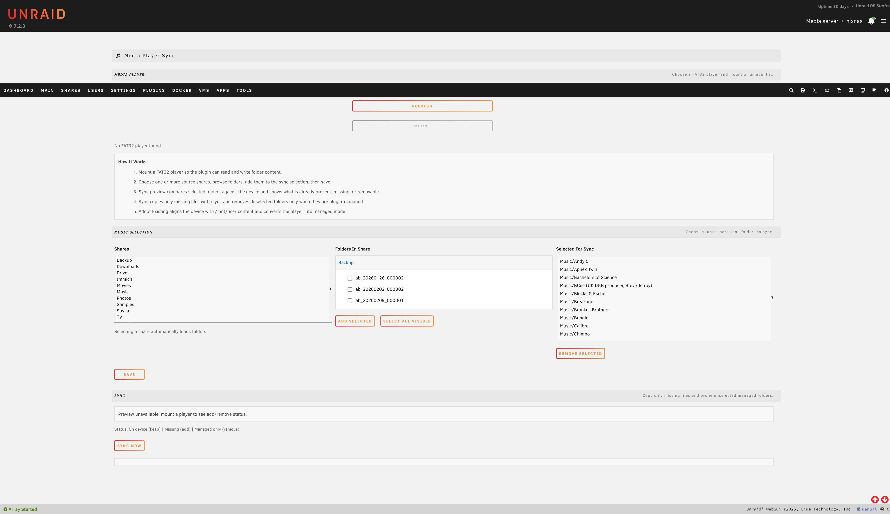

# unraid-mp

Unraid Media Player Sync plugin for managing FAT32 media players (for example Rockbox devices) from the Unraid web UI.



## What it does

- Detects attached FAT32 (`vfat`) player partitions.
- Mounts and unmounts the selected player.
- Lets you browse `/mnt/user` shares and select folders to sync.
- Shows sync preview status (on device, missing, removable managed folders).
- Syncs with `rsync --ignore-existing` so existing files on the player are not overwritten.
- Removes only previously plugin-managed folders that are now deselected.
- Supports "Adopt Existing" for unmanaged players to align and convert them into managed mode.

## Current sync model

- Destination path is share-root based: `<mountpoint>/<share>/<folder>`.
- There is no separate configurable `musicRoot` in the current flow.
- Selected folders are stored in settings as:

```json
[
  { "share": "Music", "folder": "Artist/Album" }
]
```

- Managed state is tracked per player (`managed-<player-id>.json`).
- Unmanaged players are add-only during sync.
- Managed players can prune stale plugin-managed folders.

## Adopt Existing behavior

"Adopt Existing" performs a destructive cleanup pass before switching the player to managed mode.

- Deletes files and directories on the mounted player that do not exist under `/mnt/user` at the same relative path.
- Preserves known device/system directories:
  - `.rockbox`
  - `iPod_Control`
  - `Contacts`
  - `Calendars`
  - `Notes`
  - `System Volume Information`
- Rebuilds selection roots from existing share/folder content on the device.
- Writes updated settings and managed state.

## Runtime paths

- UI route: `/Settings/MediaPlayerSync`
- API: `/usr/local/emhttp/plugins/media-player-sync/api.php`
- Plugin files: `/usr/local/emhttp/plugins/media-player-sync/`
- Settings: `/boot/config/plugins/media-player-sync/settings.json`
- Managed state files: `/boot/config/plugins/media-player-sync/managed-<id>.json`
- Lock file: `/tmp/media-player-sync.lock`
- Logs: `/tmp/media-player-sync-logs/`

## Project layout

- `media-player-sync.plg` - Unraid plugin manifest and install-time setup
- `usr/local/emhttp/plugins/media-player-sync/MediaPlayerSync.php` - page markup and browser-side logic
- `usr/local/emhttp/plugins/media-player-sync/api.php` - backend actions (mount, browse, preview, sync, adopt)
- `usr/local/emhttp/plugins/media-player-sync/plugin.css` - plugin styling
- `install-local.sh` - helper script for local install on an Unraid host

## Local install and smoke test

Run from the repository root on your Unraid server:

```bash
./install-local.sh
```

Then open `/Settings/MediaPlayerSync`.

`install-local.sh` also copies `media-player-sync.plg` to `/boot/config/plugins/media-player-sync.plg` so the plugin appears in Unraid's plugin list.

Quick validation flow:

1. Refresh players and mount a FAT32 device.
2. Pick a share, add one or more folders, and save.
3. Confirm preview shows expected add/keep/remove counts.
4. Run sync and review the log output.

## Developer notes

- POST requests are CSRF protected and currently sent as form-encoded payloads with `payload` (JSON string) plus `csrf_token`.
- `api.php` accepts form payloads first, with raw JSON body fallback.
- Use `AGENTS.md` for implementation invariants and contributor/agent guidance.

## License

MIT - see `LICENSE`.
